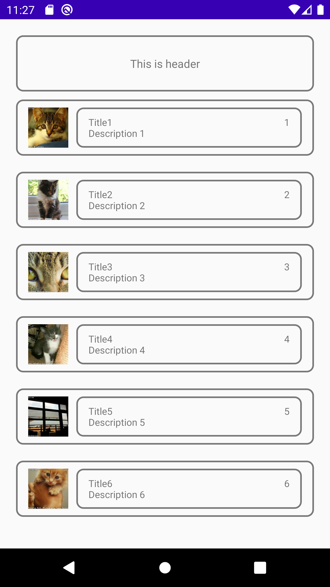

## my super cool app

## key points to load images
1. add INTERNET permission
```xml
<uses-permission android:name="android.permission.INTERNET"/>
<uses-permission android:name="android.permission.ACCESS_NETWORK_STATE"/>
```

2. uninstall old app(I just wipe data of the emulator using AVD manager), reinstall app.


